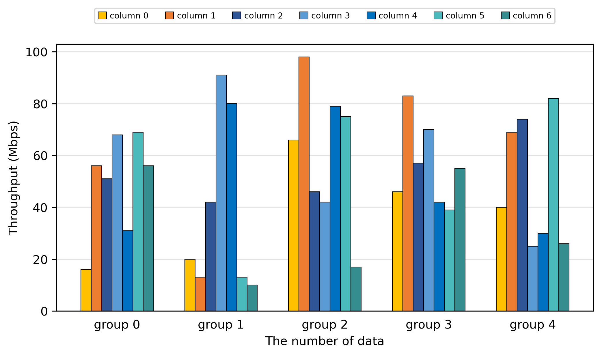

# paperplotlib

> 本项目还处于早期开发阶段, 欢迎反馈建议

[](https://codecov.io/gh/luzhixing12345/paperplotlib)

paperplotlib 是基于 matplotlib 的论文实验数据绘图库, 意在快速绘制论文实验结果部分中常见的柱状图/折线图

本库提供了一组 **论文实验数据图的默认样式**, 以及一组相对**简洁的 API 调用**

## 安装

```bash
pip install paperplotlib
```

## 快速开始

```python
import paperplotlib as ppl
import numpy as np

# 随机生成一个 5 x 7 的数据
a = 5
b = 7
y = np.random.randint(10, 100, size=(a, b))

# 初始化一个对象
graph = ppl.BarGraph()

# 传入数据/组/列的文字信息
group_names = [f"group {i}" for i in range(a)]
column_names = [f"column {i}" for i in range(b)]
graph.plot_2d(y, group_names, column_names)

# 调整x/y轴文字
graph.x_label = "The number of data"
graph.y_label = "Throughput (Mbps)"

# 保存图片
graph.save()
```



## 使用文档

视频介绍: [【项目分享】论文实验数据绘图](https://www.bilibili.com/video/BV1Qx421m7hx/)

更多使用说明请参考: [paperplotlib 使用文档](https://luzhixing12345.github.io/paperplotlib/)

## 参考

- [matplotlib](https://matplotlib.org/stable/users/index.html)
- [matplotlib.pyplot的使用总结大全](https://www.zhihu.com/tardis/zm/art/139052035?source_id=1003)
- [matplotlib.pyplot常用函数讲解大全(一)](https://zhuanlan.zhihu.com/p/139475633)
- [matplotlib.pyplot常用函数讲解大全(二)](https://zhuanlan.zhihu.com/p/139946399)
- [Presentation练习_科研论文中插图的配色原理与方案](https://www.bilibili.com/video/BV1cJ4m1j7No/)